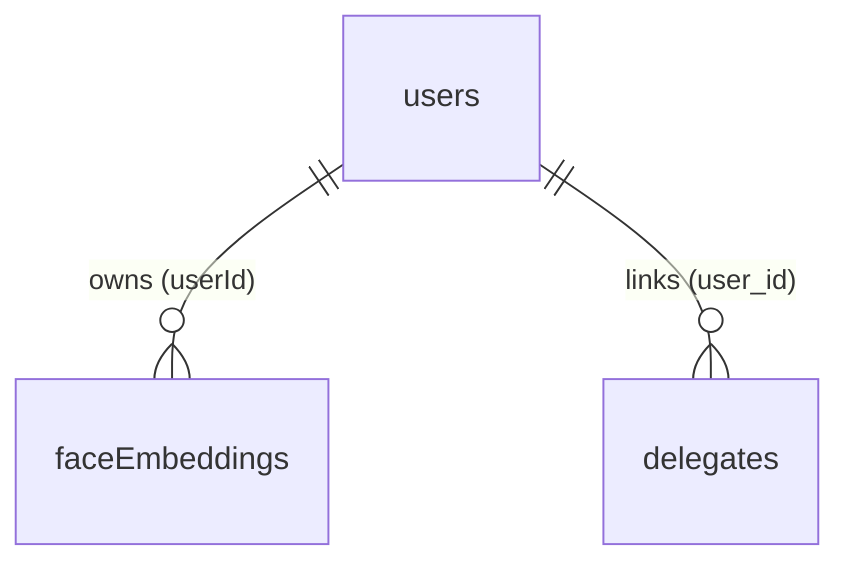

# Database Schema — Matthias (Users & Face for Login)

Scope: tables relevant to **login** and **participant creation** only. All definitions from `src/server/database/db.cjs` (models auto-synced with `sequelize.sync({ alter: true })`). All UUID PKs default to `uuidv4`. Column names shown are the actual PostgreSQL column names (`field` mappings applied).

---

## 1. Entity-Relationship Diagram (Mermaid)

---

## 2. Table Definitions

### 2.1 `users` — User accounts (staff & participants)

| Column | Type | Constraints | Notes |
|--------|------|-------------|-------|
| `id` | UUID | **PK** | default uuidv4 |
| `enName` | STRING | NOT NULL | English name |
| `zhName` | STRING | NULL | Chinese name |
| `email` | TEXT | NOT NULL, **UNIQUE** | normalized lowercase |
| `password_hash` | TEXT | NULL | SHA-256 hex |
| `photo_url` | TEXT | NULL | |
| `role` | TEXT | `staff` \| `participant` | |
| `created_at` | DATE | | timestamps: created only |

**Relationships:** 1—N `faceEmbeddings.userId`; 1—N `delegates.user_id`.

### 2.2 `faceEmbeddings` — Stored facial embeddings (registered at account creation)

| Column | Type | Constraints | Notes |
|--------|------|-------------|-------|
| `imageHash` | STRING | **PK** | SHA-256 of face crop |
| `userId` | UUID | NOT NULL, **FK → users.id** | |
| `imageType` | STRING | NOT NULL | `primary` (matching) \| `cache` |
| `imageData` | BLOB(long) | NOT NULL | JPEG bytes of face crop |
| `embeddings` | TEXT | NOT NULL | JSON array of floats (FaceNet, 512-dim) |
| `model` | STRING | NOT NULL | `facenet` |

---

## 3. Key Design Notes

- **Login:** `POST /api/auth/login` validates email against `users.email` and a SHA-256 hash of the password against `users.password_hash`, then issues a bearer token (base64 of `<userId>:<role>`).
- **Account creation:** `POST /api/auth` (staff only) creates a `users` row with `role: 'participant' | 'staff'`; an optional `faceImage` (base64) is passed to the Python FaceNet server and stored as `primary` face embeddings in `faceEmbeddings`, making the person matchable later. If face upload fails, account creation still succeeds.
- **Password storage:** `password_hash` is SHA-256 hex, never plaintext.