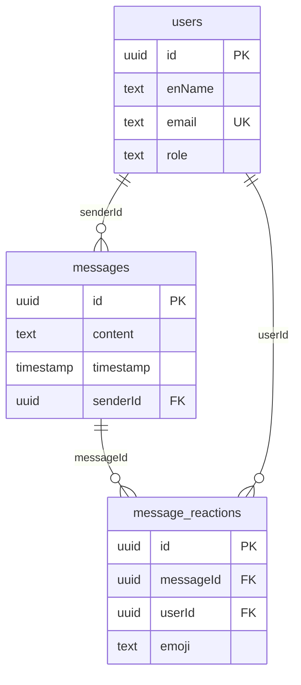

# Database Schema — Rayhan (Offline Sync & Event Chat)

Database: PostgreSQL (via Sequelize ORM, `src/server/database/db.cjs`) + client-side IndexedDB (Dexie).

**Scope:** This document covers tables used in the offline sync engine and the chat feature. The tables that sync replays against (`programmes`, `routes`, `delegates`, `programme_delegates`, `route_members`, `attendance_records`, `ready_to_depart`, `face_embeddings`, `users`) belong to other modules and are documented by their owners.

PostgreSQL tables owned/used by these features:
- `messages` — chat messages (chat feature)
- `message_reactions` — per-user emoji reactions (chat feature)

Client-side IndexedDB (Dexie, `src/client/src/db/localDB.js`, DB name `OpenGlimpseDB`) is the offline queue backing store:
- `requestCache` (key `path`) — cached GET responses for offline reads
- `pendingChanges` (key `id`, always `'current'`) — queued offline write ops

---

## 1. Entity-Relationship Diagram (Mermaid)

---

## 2. PostgreSQL Table Definitions

### 2.1 `messages` — Chat messages

| Column | Type | Constraints | Notes |
|--------|------|-------------|-------|
| `id` | UUID | **PK** | default uuidv4 |
| `content` | TEXT | NOT NULL | Message text |
| `timestamp` | DATE | NOT NULL | Send time |
| `senderId` | UUID | NOT NULL, **FK → users.id** | Author (attribute name; no `field` mapping) |

- Written by `Messages` CRUD class (`dbcrudmethods.js`): `create`, `read(limit=100)` (ascending), `update`, `delete`.
- The `/chat` namespace loads the last 100 rows (ascending) as history; each row is joined with the sender's role/name for display.
- This table is the one actually used by the chat server. The separate `ChatMessage` / `chat_messages` model exists in `db.cjs` but is **not used** by the chat server (legacy).

### 2.2 `message_reactions` — Emoji reactions on messages

| Column | Type | Constraints | Notes |
|--------|------|-------------|-------|
| `id` | UUID | **PK** | default uuidv4 |
| `messageId` | UUID | NOT NULL, **FK → messages.id** (`field: message_id`) | Target message |
| `userId` | UUID | NOT NULL, **FK → users.id** (`field: user_id`) | Reacting user |
| `emoji` | STRING | NOT NULL | Single emoji |

- **Index:** `UNIQUE (message_id, user_id)` — at most one reaction per user per message; toggle semantics (same emoji deletes, different emoji updates) depend on this.
- Read via `Reactions.readByMessageIds`, aggregated on the server into `[{ emoji, userIds[] }]` sorted by count, and broadcast through `reaction:update`.

---

## 3. Client-Side Offline Queue (Dexie / IndexedDB)

DB name: `OpenGlimpseDB` (`src/client/src/db/localDB.js`).

### `requestCache`

| Field | Type | Notes |
|-------|------|-------|
| `path` | string | **Key** — base URL path, query string stripped |
| `data` | any | Cached GET response body |

- Written on every successful online GET for a synced path.
- Read for offline GETs; throws `Not available offline` when missing.

### `pendingChanges`

| Field | Type | Notes |
|-------|------|-------|
| `id` | string | **Key** — always `'current'` (single accumulating record) |
| `ops` | array | `[{ method, path, body, token }]` queued write operations |
| `timestamp` | number | `Date.now()` at last write |

- One row accumulates all offline writes so `/sync` flushes them in a single batch.
- Deleted on successful sync; survives page reloads (persisted in IndexedDB).

---

## 4. Key Design Notes

- **Chat persistence:** chat lives in `messages`. `MessageReaction` references `messages.id`, so reactions cascade with message deletion (`ON DELETE CASCADE` via the `messages.hasMany(MessageReaction)` association).
- **Reaction uniqueness:** the `UNIQUE (message_id, user_id)` index + toggle logic keeps each user to one reaction per message, WhatsApp-style.
- **Offline replay:** the server `/sync` handler replays queued ops against the main Sequelize models; per-op failures are logged but do not abort the batch, and auth ops carry their own embedded token for re-validation. The `offline_queue` PostgreSQL model exists but is **not used** — replay happens through `pendingChanges` → `POST /sync` instead.
