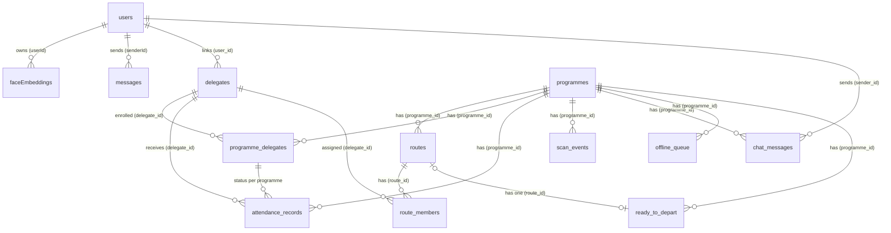

# Database Schema — OpenGlimpse (PostgreSQL + Sequelize)

All definitions from `src/server/database/db.cjs` (models auto-synced with `sequelize.sync({ alter: true })`). All UUID PKs default to `uuidv4`. Column names shown are the actual PostgreSQL column names (`field` mappings applied).

---

## 1. Entity-Relationship Diagram (Mermaid)

---

## 2. Table Definitions

### 2.1 `users` — User accounts (staff & participants)

| Column | Type | Constraints | Notes |
|--------|------|-------------|-------|
| `id` | UUID | **PK** | default uuidv4 |
| `enName` | STRING | NOT NULL | English name |
| `zhName` | STRING | NULL | Chinese name |
| `email` | TEXT | NOT NULL, **UNIQUE** | normalized lowercase |
| `password_hash` | TEXT | NULL | SHA-256 hex |
| `photo_url` | TEXT | NULL | |
| `role` | TEXT | `staff` \| `participant` | |
| `created_at` | DATE | | timestamps: created only |

**Relationships:** 1—N `faceEmbeddings.userId`; 1—N `messages.senderId`; 1—N `delegates.user_id`; 1—N `chat_messages.sender_id`.

### 2.2 `messages` — Chat messages (general chat namespace)

| Column | Type | Constraints | Notes |
|--------|------|-------------|-------|
| `id` | UUID | **PK** | |
| `content` | TEXT | NOT NULL | |
| `timestamp` | DATE | NOT NULL | |
| `senderId` | UUID | NOT NULL, **FK → users.id** | |

### 2.3 `faceEmbeddings` — Stored facial embeddings

| Column | Type | Constraints | Notes |
|--------|------|-------------|-------|
| `imageHash` | STRING | **PK** | SHA-256 of face crop |
| `userId` | UUID | NOT NULL, **FK → users.id** | |
| `imageType` | STRING | NOT NULL | `primary` (matching) \| `cache` |
| `imageData` | BLOB(long) | NOT NULL | JPEG bytes of face crop |
| `embeddings` | TEXT | NOT NULL | JSON array of floats (FaceNet, 512-dim) |
| `model` | STRING | NOT NULL | `facenet` |

**Note:** recognition (`POST /programmes/:id/recognize`) only matches against `imageType = 'primary'` rows; `PATCH /api/user/:id/face/default` replaces all primary embeddings for a user.

### 2.4 `programmes` — Delegation trips

| Column | Type | Constraints | Notes |
|--------|------|-------------|-------|
| `id` | UUID | **PK** | |
| `name` | TEXT | NOT NULL | |
| `start_date` | DATEONLY | NOT NULL | |
| `end_date` | DATEONLY | NOT NULL | |
| `status` | TEXT | default `draft` | `draft` \| `active` \| `completed` |
| `created_at` / `updated_at` | DATE | | timestamps |

**Relationships:** 1—N `routes` (CASCADE), `attendance_records` (CASCADE), `scan_events` (CASCADE), `chat_messages` (CASCADE), `offline_queue` (CASCADE), `programme_delegates` (CASCADE), `ready_to_depart`.

### 2.5 `routes` — Coaches / venue legs of a programme

| Column | Type | Constraints | Notes |
|--------|------|-------------|-------|
| `id` | UUID | **PK** | |
| `programme_id` | UUID | NOT NULL, **FK → programmes.id** | |
| `name` | TEXT | NOT NULL | e.g. "Coach 1" |
| `archived` | BOOLEAN | default `false` | |
| `created_at` | DATE | | |

**Relationships:** N—1 `programmes`; 1—N `route_members` (CASCADE); 1—0..1 `ready_to_depart`.

### 2.6 `delegates` — Person master records

| Column | Type | Constraints | Notes |
|--------|------|-------------|-------|
| `id` | UUID | **PK** | |
| `name` | TEXT | NOT NULL | |
| `badge` | TEXT | NULL | QR badge identifier |
| `photo_url` | TEXT | NULL | |
| `user_id` | UUID | NULL, **FK → users.id** | links to face embeddings |
| `created_at` | DATE | | |

**Relationships:** N—1 `users`; 1—N `programme_delegates` (CASCADE), `attendance_records`, `route_members`.

### 2.7 `programme_delegates` — Many-to-many join: programme ↔ delegate

| Column | Type | Constraints | Notes |
|--------|------|-------------|-------|
| `id` | UUID | **PK** | |
| `programme_id` | UUID | NOT NULL, **FK → programmes.id** | |
| `delegate_id` | UUID | NOT NULL, **FK → delegates.id** | |
| `notes` | TEXT | default `""` | |

**Indexes:** UNIQUE (`programme_id`, `delegate_id`); separate indexes on `programme_id`, `delegate_id`.

### 2.8 `attendance_records` — Attendance per delegate per programme

| Column | Type | Constraints | Notes |
|--------|------|-------------|-------|
| `id` | UUID | **PK** | |
| `programme_id` | UUID | NOT NULL, **FK → programmes.id** | |
| `delegate_id` | UUID | NOT NULL, **FK → delegates.id** | |
| `status` | TEXT | NOT NULL | `present` \| `absent` |
| `method` | TEXT | NOT NULL | `auto` \| `manual` \| `qr` |
| `checked_in_at` | DATE | default now | |
| `checked_in_by` | UUID | NULL | staff user id |
| `notes` | TEXT | default `""` | |

**Indexes:** `programme_id`, `delegate_id`. No timestamps. One row per (programme, delegate) — marking present/absent updates the existing row.

### 2.9 `route_members` — Route assignment join (one route per delegate)

| Column | Type | Constraints | Notes |
|--------|------|-------------|-------|
| `id` | UUID | **PK** | |
| `route_id` | UUID | NOT NULL, **FK → routes.id** | |
| `delegate_id` | UUID | NOT NULL, **FK → delegates.id** | |
| `programme_id` | UUID | NOT NULL, **FK → programmes.id** | |

**Indexes:** UNIQUE (`programme_id`, `delegate_id`); indexes on `route_id`, `delegate_id`, `programme_id`.

### 2.10 `ready_to_depart` — Route departure readiness

| Column | Type | Constraints | Notes |
|--------|------|-------------|-------|
| `id` | UUID | **PK** | |
| `programme_id` | UUID | NOT NULL, **UNIQUE**, **FK → programmes.id** | |
| `route_id` | UUID | NULL, **FK → routes.id** | |
| `ready` | BOOLEAN | default `false` | |
| `toggled_by` | UUID | NULL | staff user id |
| `toggled_at` | DATE | NULL | |

### 2.11 `scan_events` — Face scan results (verified & alerts)

| Column | Type | Constraints | Notes |
|--------|------|-------------|-------|
| `id` | UUID | **PK** | |
| `programme_id` | UUID | NOT NULL, **FK → programmes.id** | |
| `delegate_id` | UUID | NULL, FK → delegates.id | null when unidentified |
| `confidence` | REAL | NULL | cosine similarity |
| `status` | TEXT | NOT NULL | `verified` \| `unverified` |
| `unverified_reason` | TEXT | NULL | e.g. "No face detected in image", "No matching face found" |
| `bounding_box_id` | TEXT | NULL | |
| `scanned_at` | DATE | default now | |

**Role:** powers the admin alert list — unverified rows are surfaced via `/attendance` and `/attendance/summary` and cleared when the person is later marked present.

### 2.12 `chat_messages` — Programme chat messages

| Column | Type | Constraints | Notes |
|--------|------|-------------|-------|
| `id` | UUID | **PK** | |
| `programme_id` | UUID | NULL, **FK → programmes.id** | null for general chat |
| `sender_id` | UUID | NOT NULL, **FK → users.id** | AI Assistant is a seeded user |
| `text` | TEXT | NOT NULL | |
| `sent_at` | DATE | default now | |

### 2.13 `offline_queue` — Server-side dedup for offline sync

| Column | Type | Constraints | Notes |
|--------|------|-------------|-------|
| `id` | UUID | **PK** | |
| `scan_id` | TEXT | NOT NULL, **UNIQUE** | dedup key (device+timestamp) |
| `device_id` | TEXT | NOT NULL | |
| `programme_id` | UUID | NOT NULL, **FK → programmes.id** | |
| `payload` | JSONB | NOT NULL | full op payload |
| `synced_at` | DATE | default now | |
| `processed` | BOOLEAN | default `false` | |

---

## 3. Legacy / Unused Tables

| Table | Columns | Status |
|-------|---------|--------|
| `attendee` | `id` (PK), `name` | Defined but unused |
| `admin` | `id` (PK), `name`, `privileges` | Defined but unused |
| `staff` | `id` (PK), `name`, `email` (UNIQUE), `password_hash`, `photo_url`, `role` (`admin`\|`staff`), `created_at` | Defined but unused — **`users` is the active account model** |

---

## 4. Key Design Notes

- **Embedding storage:** FaceNet embeddings stored as JSON text in `faceEmbeddings.embeddings`; matching is done in Node (cosine similarity ≥ 0.5) rather than pgvector.
- **Attendance idempotency:** `attendance_records` has no unique constraint, but the code path always looks up an existing row for (programme, delegate) before insert/update, keeping one row per pair.
- **Route uniqueness:** `route_members` UNIQUE(`programme_id`, `delegate_id`) enforces "one route per delegate"; moving a delegate destroys prior membership first.
- **Sync dedup:** `offline_queue.scan_id` is unique; replay of the same offline op cannot create duplicates.
- **Cascades:** deleting a programme cascades to routes, attendance, scan events, chat messages, offline queue, programme_delegates; deleting a delegate cascades programme_delegates (embeddings live on `users`, so delegate deletion does not remove face data).
