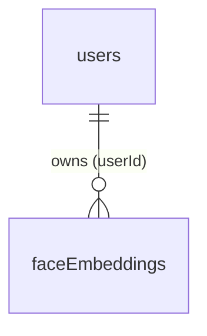

# Database Schema — OpenGlimpse (PostgreSQL + Sequelize) — Ryan

All definitions from `src/server/database/db.cjs` (models auto-synced with `sequelize.sync({ alter: true })`). All UUID PKs default to `uuidv4`. Column names shown are the actual PostgreSQL column names (`field` mappings applied).

**Scope:** This document covers the tables owned by Ryan's features only — face recognition, QR badge lookup, and the chatbot. The following tables are owned by other members and depend on their modules (documented by the respective owners):

- `programmes`, `routes`, `delegates`, `programme_delegates`, `attendance_records`, `route_members`, `ready_to_depart`, `scan_events` — programme/attendance module (Matthias)
- `messages`, `chat_messages` — chat module (Matthias)
- `offline_queue` — sync module
- `attendee`, `admin`, `staff` — legacy/unused

---

## 1. Entity-Relationship Diagram (Mermaid)

---

## 2. Table Definitions

### 2.1 `users` — User accounts (staff & participants)

| Column | Type | Constraints | Notes |
|--------|------|-------------|-------|
| `id` | UUID | **PK** | default uuidv4 |
| `enName` | STRING | NOT NULL | English name |
| `zhName` | STRING | NULL | Chinese name |
| `email` | TEXT | NOT NULL, **UNIQUE** | normalized lowercase |
| `password_hash` | TEXT | NULL | SHA-256 hex |
| `photo_url` | TEXT | NULL | |
| `role` | TEXT | `staff` \| `participant` | |
| `created_at` | DATE | | timestamps: created only |

**Relationships:** 1—N `faceEmbeddings.userId`. Other links (`messages.senderId`, `delegates.user_id`, `chat_messages.sender_id`) belong to other modules' tables.

### 2.2 `faceEmbeddings` — Stored facial embeddings

| Column | Type | Constraints | Notes |
|--------|------|-------------|-------|
| `imageHash` | STRING | **PK** | SHA-256 of face crop |
| `userId` | UUID | NOT NULL, **FK → users.id** | |
| `imageType` | STRING | NOT NULL | `primary` (matching) \| `cache` |
| `imageData` | BLOB(long) | NOT NULL | JPEG bytes of face crop |
| `embeddings` | TEXT | NOT NULL | JSON array of floats (FaceNet, 512-dim) |
| `model` | STRING | NOT NULL | `facenet` |

**Note:** recognition (`POST /programmes/:id/recognize`) only matches against `imageType = 'primary'` rows; `PATCH /api/user/:id/face/default` replaces all primary embeddings for a user. Recognized delegates and scan results are stored in the programme module's `delegates` and `scan_events` tables.

---

## 3. Key Design Notes

- **Embedding storage:** FaceNet embeddings stored as JSON text in `faceEmbeddings.embeddings`; matching is done in Node (cosine similarity ≥ 0.5) rather than pgvector.
- **Dependencies:** Face recognition and QR lookup rely on the programme module's `delegates` / `programme_delegates` / `scan_events`; the chatbot relies on the chat module's `chat_messages`; auth relies on `users`.
